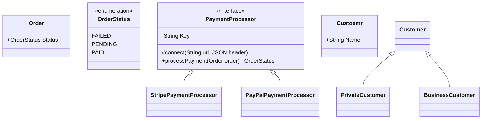

# Class Diagrams

```mermaid
classDiagram
    class Order {
        +OrderStatus Status
    }
    class OrderStatus {
        <<enumeration>>
        FAILED
        PENDING
        PAID
    }
    class PaymentProcessor {
        <<interface>>
        -String Key
        #connect(String url, JSON header)
        +processPayment(Order order) OrderStatus
    }
    class Custoemr {
        +String Name
    }
    Customer <|-- PrivateCustomer
    Customer <|-- BusinessCustomer
    PaymentProcessor <|-- StripePaymentProcessor
    PaymentProcessor <|-- PayPalPaymentProcessor
```