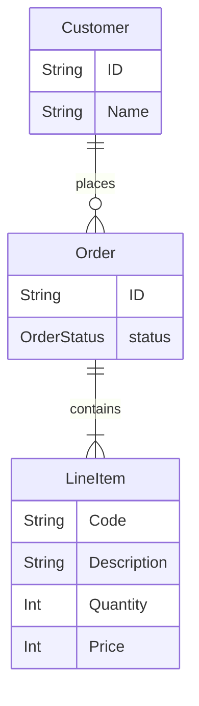

# Entity Relationship Diagram

```mermaid
%% visual representation of entities and their relationships within a database.
erDiagram
    Customer ||--o{ Order: places
    Order ||--|{ LineItem: contains
    Customer {
        String ID
        String Name
    }
    Order {
        String ID
        OrderStatus status
    }
    LineItem {
        String Code
        String Description 
        Int Quantity
        Int Price
    }
```