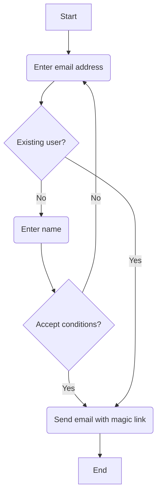

# Flowcharts

```mermaid
flowchart TB
    S[Start]-->A;
    A(Enter email address) --> B{Existing user?};
    B -->|No| C(Enter name)
    C -->D{Accept conditions?}
    D -->|No| A
    D -->|Yes| E(Send email with magic link)
    B -->|Yes| E
    E -->End;
```